# 🧠 Stroke Prediction App

## 📋 Overview
This project is a machine learning application that predicts the likelihood of a patient having a stroke based on various health metrics. The process involves training and evaluating several machine learning models on a provided healthcare dataset, identifying the best-performing model, and then deploying it within an interactive web application built with Streamlit.

---

## 🗂️ File Structure
- **`healthcare-dataset-stroke-data.csv`** 📄: The primary dataset used for model training and evaluation.  
- **`model_evaluation_and_tuning.py`** 🧪: Performs data preprocessing, trains and evaluates multiple machine learning models (Decision Tree, Random Forest, AdaBoost, XGBoost, CatBoost), and saves the best-performing model as a pickle file if it meets a performance threshold.  
- **`best_model.pkl`** 💾: The serialized machine learning model, created by `model_evaluation_and_tuning.py`, which is loaded by the Streamlit application for making predictions.  
- **`streamlit_app.py`** 🌐: The Python script for the interactive web application. It takes user input and uses the `best_model.pkl` file to generate a stroke likelihood prediction.  
- **`requirements.txt`** 📦: A list of all Python libraries required to run the project.  
- **`README.md`** 📝: This file, providing an overview of the project.

---

## 🏗️ Project Architecture
The project's architecture is a streamlined, three-step pipeline designed for efficient model development and deployment.

```mermaid
flowchart TD
    subgraph Data & Training Pipeline
        A[📄 healthcare-dataset-stroke-data.csv] -->|Reads & Preprocesses Data| B[⚙️ model_evaluation_and_tuning.py]
        B -->|Trains & Evaluates Models| C(📦 best_model.pkl)
    end
    
    subgraph Prediction Service
        C -->|Loads Model| D[🌐 streamlit_app.py]
        D -- "Accepts user input" --> E((👤 User Input))
        E -- "Feeds data to model" --> D
        D -- "Returns prediction" --> F((✅ Prediction Result))
    end
    
    A & B & C & D & E & F
```

## 🧠 Model Development & Prediction Pipeline

1. **📊 Model Development**  
   The `model_evaluation_and_tuning.py` script serves as the core of the machine learning pipeline. It handles everything from data cleaning and preprocessing to training multiple regression models.  
   This script is responsible for finding the most accurate model and evaluating its performance on metrics like:  
   - **MAE** (Mean Absolute Error)  
   - **MSE** (Mean Squared Error)  
   - **R² Score**  

2. **💾 Model Persistence**  
   After identifying the best-performing model, the script serializes it into a `best_model.pkl` file.  
   Saving the model ensures it is ready for immediate use without needing to be retrained, which is essential for rapid deployment.

3. **🌐 Prediction Service**  
   The `streamlit_app.py` file acts as the front-end for the application. It loads the `best_model.pkl` file at startup and provides a user interface.  
   The web application:  
   - Accepts user inputs for a new patient  
   - Passes the data to the loaded model  
   - Generates a real-time prediction for the patient's likelihood of a stroke  

---

## 📚 Dependencies

### 1. Core Libraries
- **🌐 streamlit**: Main library for building the web application  
- **🧠 scikit-learn**: For data preprocessing, model training, and evaluation  
- **💾 pickle**: For serializing and deserializing the trained model  

### 2. Data Science & Visualization
- **🐼 pandas**: For data manipulation and analysis  
- **🔢 numpy**: For numerical operations  
- **⚡ xgboost & catboost**: For high-performance gradient boosting models  
- **📊 matplotlib & seaborn**: For creating plots and visualizations

